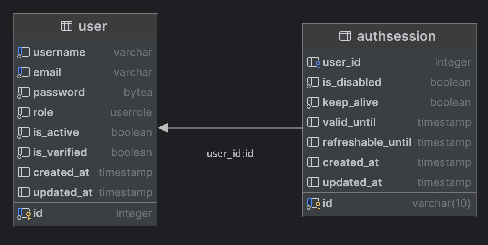

# ✅ Implementation of the Coffee Shop API technical assignment

## ER-Diagram of DB


## ℹ️ How to run the project

### Installing

1. Clone the repository and navigate to the project directory:
```shell
git clone https://github.com/HoPHNiDev/coffee_api.git
cd coffee_api
```
2. Install the dependencies:
```shell
pip install uv
uv venv
source .venv/bin/activate
uv sync
```
3. Fulfill the `.env-example` environment variables'
4. Generate JWT public and private keys:
```shell
openssl genpkey -algorithm RSA -out app/core/keys/jwt-private.pem -pkeyopt rsa_keygen_bits:2048
openssl rsa -pubout -in app/core/keys/jwt-private.pem -out app/core/keys/jwt-public.pem
```
5. Run the migrations:
```shell
alembic upgrade head
```

### Running the project
```shell
python3 app/main.py
```

### Key differences with Technical specification(TS)
 - `POST /auth/verify`'s method implemented as `GET` in code ([link to file](./app/routes/v1/user.py)) for access just from link
 - Added additional route `POST /auth/logout` for user logout
 - Verification code sending using FastAPI's BackgroundTasks instance. 
It can be implemented via Celery or via message brokers
(best option is faststream library)
 - Unverified user's autodelete could be implemented via Celery
(`task which will get not verified users and delete them and Celery Beat, which will run this task every day`), 
It’s already 1 AM, and I’m getting sleepy… otherwise, I’d have implemented this feature too. 

### Project structure
#### You can check the structure of this project in this [**file**](STRUCTURE.md).
The way I see the structure of the project, I think it is obvious from the structure of the code of this repository.

## ✍️ Questions? Pm me

- Telegram: [@HoPHNi](https://t.me/HoPHNi)